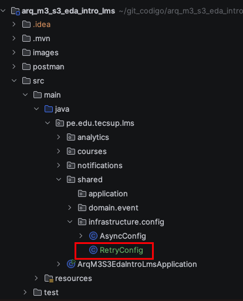
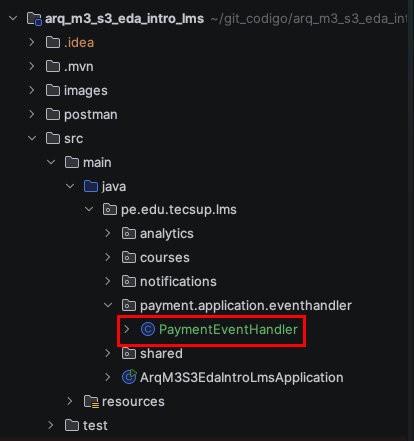
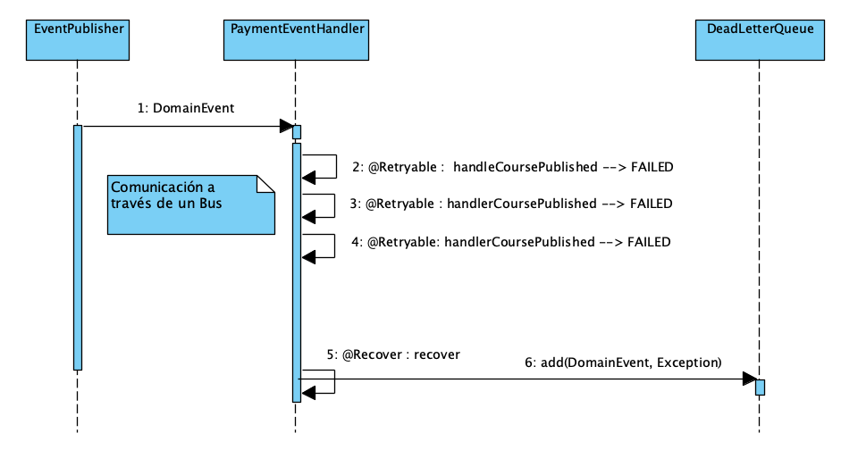
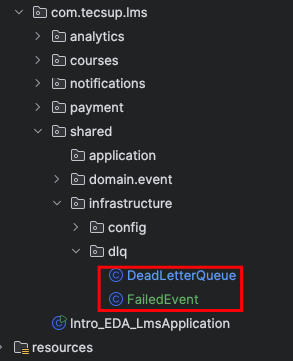
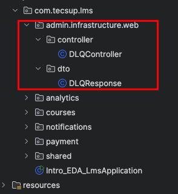

# Implementación de EDA

## 1. Diagrama de clases


## 2. Pruebas

### 2.1. Crear un curso
POST : http://localhost:8080/api/courses

```json
{
  "title": "Spring Boot Masterclass - version 2",
  "description": "Learn Spring Boot from scratch",
  "instructor": "John Doe"
}

```

### 2.2. Publicar un curso

PUT : http://localhost:8080/api/courses/1/publish

Donde el ID del curso es 1

## 3. Ejercicios

### Crear Eventos y Handlers para los siguientes casos:

#### StudentEnrolledEvent
- Handler: Enviar email de bienvenida
- Handler: Actualizar estadísticas del curso
- Handler: Crear acceso al material

#### LessonCompletedEvent
- Handler: Actualizar progreso
- Handler: Enviar notificación de logro
- Handler: Verificar si completó el curso


## 4. Implementando Retry

### 4.1. Agregar la dependencia
```xml  
     <!-- Spring Retry -->
     <dependency>
         <groupId>org.springframework.retry</groupId>
         <artifactId>spring-retry</artifactId>
         <version>2.0.4</version>  <!-- La versión es importante considerarla -->
     </dependency>
     <dependency>
         <groupId>org.springframework</groupId>
         <artifactId>spring-aspects</artifactId>
     </dependency>
     
```
### 4.2. Crear la clase de Configruacion para habilitar Spring Retry





RetryConfig.java

```java
package pe.edu.tecsup.lms.shared.infrastructure.config;

import org.springframework.context.annotation.Configuration;
import org.springframework.retry.annotation.EnableRetry;

@Configuration
@EnableRetry
public class RetryConfig {
}


```

### 4.3. Crear el archivo PaymentEventHandler.java




PaymentEventHandler.java

```java
package pe.edu.tecsup.lms.payment.application.eventhandler;

import lombok.extern.slf4j.Slf4j;
import org.springframework.context.event.EventListener;
import org.springframework.retry.annotation.Backoff;
import org.springframework.retry.annotation.Recover;
import org.springframework.retry.annotation.Retryable;
import org.springframework.scheduling.annotation.Async;
import org.springframework.stereotype.Component;
import pe.edu.tecsup.lms.courses.domain.event.CoursePublishedEvent;

import java.util.Random;

@Slf4j
@Component
public class PaymentEventHandler {

    private final Random random = new Random();

    @Async("eventExecutor")
    @EventListener
    // Agregar caracteristicas de reintento
    @Retryable(
            maxAttempts = 1,  // Cantidad de reintentos
            backoff = @Backoff(delay = 1000,
            multiplier = 2))
    public void handleCoursePublished(CoursePublishedEvent event) throws InterruptedException {

        log.info("Processing payment ........ : {}", event);

        if (this.random.nextBoolean()) {
            log.info("Processing payment take longer times ........ : {}", event);
            throw new RuntimeException("Payment failed");
        } else {
            log.info("Payment successfully processed");
        }

    }

    @Recover
    public void recover(RuntimeException e,  CoursePublishedEvent event ) {
        //
        log.error("All retries out for recover exception : {}", e.getMessage());
    }

}

```


## 5.- Ejercicio : Crear intentos de :
- CourseCreatedEvent   -->  [notifications] handleCourseCreated:  ( 2 intentos)
- StudentEnrolledEvent -->  Handler: Enviar email de bienvenida ( 2 intentos)

## 6.- Dead Letter Queue (DLQ)




### 6.1.- Crear el FailedEvent




FailedEvent.java

```java
package pe.edu.tecsup.lms.shared.infrastructure.dlq;


import lombok.AllArgsConstructor;
import lombok.Getter;
import pe.edu.tecsup.lms.shared.domain.event.DomainEvent;

@Getter
@AllArgsConstructor
public class FailedEvent {

    private final DomainEvent event;
    private final String message;
    private final long timestamp;

}

```

### 6.2.- Crear una clase DLQ para almacenar los eventos fallidos : DeadLetterQueue.java


   ```java
    @Slf4j
    @Component
    public class DeadLetterQueue {
    
        // Coleccion para almacenar eventos fallidos
        private final ConcurrentLinkedQueue<FailedEvent> failedEvents = new ConcurrentLinkedQueue<>();
    
        // Método para agregar un evento fallido a la DLQ
        public void add(DomainEvent event, Exception exception) {
    
            // Crear un objeto FailedEvent con detalles del evento fallido
            FailedEvent failedEvent = new FailedEvent(
                    event,
                    exception.getMessage(),
                    System.currentTimeMillis()
            );
    
            // Agregar el evento fallido a la cola
            failedEvents.add(failedEvent);
    
        }

        // Metodo para obtener todos los eventos fallidos almacenados en la DLQ
        public List<FailedEvent> getFailedEvents() {
            return new ArrayList<>(failedEvents);
        }
    
    }
   ```

### 6.3  Agregar lógica para almacenar eventos fallidos en la DLQ dentro del PaymentEventHandler : PaymentEventHandler.java

   ```java
    @Slf4j
    @Component
    @RequiredArgsConstructor  // Agregar constructor para inyección de dependencias
    public class PaymentEventHandler {
    
        ......
        private final DeadLetterQueue dlq;  // Inyectar la DLQ
    
        .....
    
    
        @Recover  // Manejo cuando se agotan los reintentos
        public void recover(RuntimeException e, CoursePublishedEvent event) {
            
            .....
            
            dlq.add(event, e);  // Agregar al final del metodo 
        }
    
    }
   ```
### 6.4.- Probar la funcionalidad de la DLQ
- Publicar un curso varias veces para observar que los eventos fallidos se almacenan en la DLQ después de agotar los reintentos.


## 7.- Visualizar los EventFailed en Dead Letter Queue (DLQ)



### 7.1. Crear un DTO para representar los eventos fallidos

```java
package pe.edu.tecsup.lms.admin.infrastructure.web.dto;

import lombok.Builder;
import lombok.Getter;
import pe.edu.tecsup.lms.shared.infrastructure.dlq.FailedEvent;

import java.util.List;

@Getter
@Builder
public class DLQResponse {
    private List<FailedEvent> failedEvents;
}

```


### 7.2. Crear un Controlador para exponer en un endpoint el DLQ

```java
package pe.edu.tecsup.lms.admin.infrastructure.web.controller;

import lombok.RequiredArgsConstructor;
import org.springframework.http.ResponseEntity;
import org.springframework.web.bind.annotation.GetMapping;
import org.springframework.web.bind.annotation.RequestMapping;
import org.springframework.web.bind.annotation.RestController;
import pe.edu.tecsup.lms.admin.infrastructure.web.dto.DLQResponse;
import pe.edu.tecsup.lms.shared.infrastructure.dlq.DeadLetterQueue;
import pe.edu.tecsup.lms.shared.infrastructure.dlq.FailedEvent;

import java.util.List;

@RestController
@RequestMapping("/api/admin/dlq")
@RequiredArgsConstructor
public class DLQController {

    private final DeadLetterQueue deadLetterQueue;

    @GetMapping
    public ResponseEntity<DLQResponse> getFailedEvents() {

        DLQResponse response
                = DLQResponse.builder()
                .failedEvents(this.deadLetterQueue.getFailedEvents())
                .build();

        return ResponseEntity.ok(response);
    }

}
```

### 7.3. Probar el endpoint para visualizar los eventos fallidos

- GET
```
http://localhost:8080/api/admin/dlq
```
# felipe-microservicios-kafka
