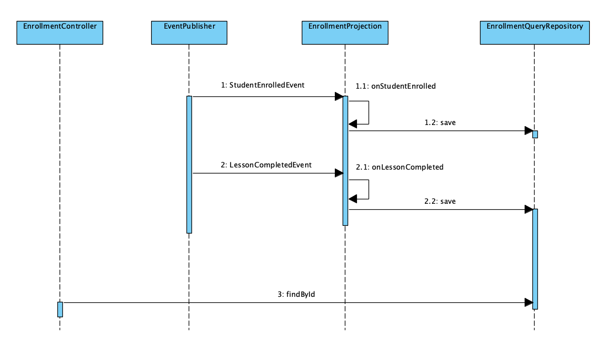
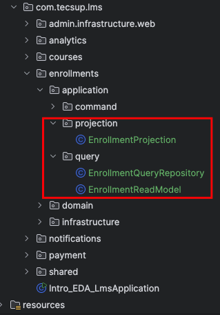
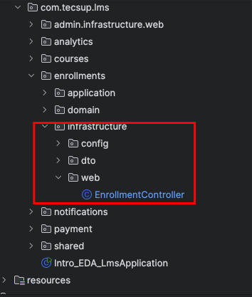

## Implementacion de CQRS ; Enrollment

### Diagrama de Secuencia




1.- Crear el modelo de solo lectura, el repositorio y el projection

Localización:



- **EnrollmentReadModel.java**

```java
package pe.edu.tecsup.lms.enrollments.application.query;

import lombok.AllArgsConstructor;
import lombok.Builder;
import lombok.Getter;
import lombok.Setter;

@Getter
@AllArgsConstructor
@Builder
public class EnrollmentReadModel {

    private final String enrollmentId;
    private final String studentId;
    private final String courseId;

    // Data desnormalizada
    private final String studentName;

    // Lesson
    @Setter
    private int progress;

}

```

- **EnrollmentQueryRepository.java**

```java
package pe.edu.tecsup.lms.enrollments.application.query;

import org.springframework.stereotype.Component;

import java.util.*;

@Component
public class EnrollmentQueryRepository {

    private final Map<String, EnrollmentReadModel> readModels = new HashMap<>();

    // Update

    /**
     *
     * @param readModel
     */
    public void save(EnrollmentReadModel readModel) {
        this.readModels.put(readModel.getEnrollmentId(), readModel);
    }

    // Read

    /**
     *
     * @param enrollmentId
     * @return
     */
    public Optional<EnrollmentReadModel> findByEnrollmentId(String enrollmentId) {

        return Optional.ofNullable(this.readModels.get(enrollmentId));

    }


    /**
     *
     * @return
     */
    public List<EnrollmentReadModel> findAll() {

        return  new ArrayList<>(this.readModels.values());
    }

    
}

```

- **EnrollmentProjection.java**
```java
package pe.edu.tecsup.lms.enrollments.application.projection;

import lombok.RequiredArgsConstructor;
import lombok.extern.slf4j.Slf4j;
import org.springframework.context.event.EventListener;
import org.springframework.stereotype.Component;
import pe.edu.tecsup.lms.enrollments.application.query.EnrollmentQueryRepository;
import pe.edu.tecsup.lms.enrollments.application.query.EnrollmentReadModel;
import pe.edu.tecsup.lms.enrollments.domain.event.LessonCompletedEvent;
import pe.edu.tecsup.lms.enrollments.domain.event.StudentEnrolledEvent;

@Slf4j
@Component
@RequiredArgsConstructor
public class EnrollmentProjection {

    private final EnrollmentQueryRepository repository;

    /**
     *  Listening of StudentEnrolledEvent
     */
    @EventListener
    public void  onStudentEnrolled(StudentEnrolledEvent event) {

        log.info("EnrollmentProjection.onStudentEnrolled(event={})", event);


        var model = EnrollmentReadModel.builder()
                .enrollmentId(event.getEnrollmentId())
                .courseId(event.getCourseId())
                .studentId(event.getStudentId())
                .studentName(event.getStudentName())
                .progress(0)
                .build();

        this.repository.save(model);
    }

    /**
     *  Listening of LessonCompletedEvent
     */
    @EventListener
    public void  onLessonCompleted(LessonCompletedEvent event) {

        log.info("EnrollmentProjection.onLessonCompleted(event={})", event);

        // Buscar la INFO
        EnrollmentReadModel readModel
                = this.repository.findByEnrollmentId(event.getEnrollmentId()).orElseThrow();

        // Actualiza le progresso de la lección
        var newProgress = readModel.getProgress() + event.getNewProgressPercentage();

        readModel.setProgress(newProgress);

        // Guardar el objeto actualizado
        this.repository.save(readModel);

    }
    
}


```
2.- Se realiza las pruebas
- **EnrollmentProjectionTest.java**
```java
package pe.edu.tecsup.lms.enrollments.application.query;

import lombok.AllArgsConstructor;
import lombok.Builder;
import lombok.Getter;
import lombok.Setter;

@Getter
@AllArgsConstructor
@Builder
public class EnrollmentReadModel {

    private final String enrollmentId;
    private final String studentId;
    private final String courseId;

    // Data desnormalizada
    private final String studentName;

    // Lesson
    @Setter
    private int progress;

}

```


3.- Modificar EnrollmentController para agregar endpoint de consulta


Localización:




```java


import com.tecsup.lms.enrollments.application.command.EnrollStudentCommand;
import com.tecsup.lms.enrollments.application.command.EnrollmentCommandHandler;
import com.tecsup.lms.enrollments.application.query.EnrollmentQueryRepository;
import com.tecsup.lms.enrollments.application.query.EnrollmentReadModel;
import com.tecsup.lms.enrollments.domain.model.Enrollment;
import com.tecsup.lms.enrollments.infrastructure.dto.EnrollmentRequest;
import com.tecsup.lms.enrollments.infrastructure.dto.EnrollmentResponse;
import lombok.RequiredArgsConstructor;
import lombok.extern.slf4j.Slf4j;
import org.springframework.http.ResponseEntity;
import org.springframework.web.bind.annotation.*;

@Slf4j
@RestController
@RequestMapping("/api/enrollments")
@RequiredArgsConstructor
public class EnrollmentController {

    private final EnrollmentCommandHandler enrollmentCommandHandler;
    private final EnrollmentQueryRepository enrollmentQueryRepository; // agregar

     ......


    /**
     *  NUEVO END POINT : CQRS --> READ MODE
     * @param id
     * @return
     */
    @GetMapping("/{id}")
    public ResponseEntity<EnrollmentReadModel> getEnrollmentDetails(@PathVariable String id) {
        EnrollmentReadModel readModel = enrollmentQueryRepository.findById(id)
                .orElseThrow(() -> new RuntimeException("Enrollment not found"));

        return ResponseEntity.ok(readModel);
    }


}

   
```

4.- Probar el endpoint de consulta

Archivo JSON para la pruebas en la  <a href="postman/EDA_ES_CQRS.postman_collection.json">ruta</a>


-  Crear el curso
-  Publicar el curso
-  Inscribir un estudiante
-  El estudiante entrega 2 lecciones
-  Se consulta el endpoint /api/enrollments/{id} para verificar que el read model refleja el progreso actualizado.
    
