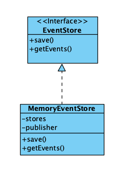
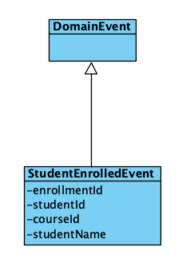
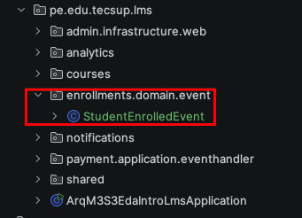
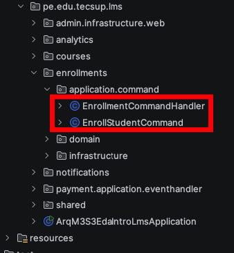
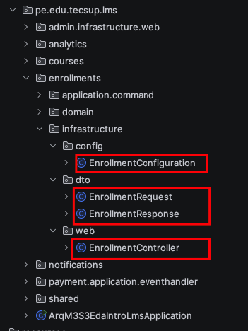

# Implementación de Event Sourcing 




# 1.1. Crear Event Store (Almacén de evntos)

EventStore.java
```Java
package pe.edu.tecsup.lms.shared.infrastructure.eventsourcing;

import java.util.List;

public interface EventStore {

    void save(String aggregateId, DomainEvent event);

    List<DomainEvent> getEvents(String aggregateId);

}
```

MemoryEventStore.java

```java
package pe.edu.tecsup.lms.shared.infrastructure.eventsourcing;

import lombok.extern.slf4j.Slf4j;
import org.springframework.context.ApplicationEventPublisher;
import org.springframework.stereotype.Component;
import pe.edu.tecsup.lms.shared.domain.event.DomainEvent;

import java.util.ArrayList;
import java.util.List;
import java.util.Map;
import java.util.concurrent.ConcurrentHashMap;

@Slf4j
@Component
public class MemoryEventStore implements EventStore{

    // final es necesario

    private final Map<String, List<DomainEvent>> stores = new ConcurrentHashMap<>();

    private final ApplicationEventPublisher publisher;

    public MemoryEventStore(ApplicationEventPublisher publisher) {
        this.publisher = publisher;
    }

    /**
     * Graba un evento
     * @param aggregateId
     * @param event
     */
    @Override
    public void save(String aggregateId, DomainEvent event) {

        // Agregar el evento  al stores
        this.stores.computeIfAbsent(aggregateId, key -> new ArrayList<>())
                .add(event);

        // Publicar el evento
        publisher.publishEvent(event);
    }

    
    /**
     *
     * @param aggregateId
     * @return
     */
    @Override
    public List<DomainEvent> getEvents(String aggregateId) {
        return new ArrayList<>(stores.getOrDefault(aggregateId, List.of()));

    }
}

```
# 1.2. Crear clase de pruebas para probar el MemoryEventStoreTest

```java
package pe.edu.tecsup.lms.shared.infrastructure.eventsourcing;

import org.junit.jupiter.api.BeforeEach;
import org.junit.jupiter.api.Test;
import org.mockito.Mockito;
import org.springframework.context.ApplicationEventPublisher;
import pe.edu.tecsup.lms.shared.domain.event.DomainEvent;

import static org.junit.jupiter.api.Assertions.*;

/**
 *  Eventos para pruebas
 */
class TestEvent extends DomainEvent {

    private final String data;

    public TestEvent( String data) {

        super();
        this.data = data;

    }

}

public class MemoryEventStoreTest {

    private MemoryEventStore eventStore;
    private ApplicationEventPublisher publisher;

    @BeforeEach
    void init(){
        this.publisher = Mockito.mock(ApplicationEventPublisher.class);
        this.eventStore = new MemoryEventStore(publisher);

    }

    @Test
    void save() {

        String aggregateId = "matricula-1";

        TestEvent event1 = new TestEvent("Datos de la matricula del estudiante 1");
        TestEvent event2 = new TestEvent("Datos de la matricula del estudiante 2");

        // Guardar los eventos
        this.eventStore.save(aggregateId, event1);
        this.eventStore.save(aggregateId, event2);

        // Recuperar todos los eventos
        var events = this.eventStore.getEvents(aggregateId);

        // Validar
        assertEquals(2 , events.size());

    }

}
```

# 1.3. Crear el evento StudentEnrolledEvent



- Localización 



- StudentEnrolledEvent.java
```java
package pe.edu.tecsup.lms.enrollments.domain.event;

import lombok.Builder;
import lombok.Getter;
import pe.edu.tecsup.lms.shared.domain.event.DomainEvent;

@Getter
@Builder
public class StudentEnrolledEvent  extends DomainEvent {

    private final String enrollmentId;
    private final String studentId;
    private final String studentName;
    private final String courseId;

}
```

# 1.4. Crear Aggregate Enrollment

- Creamos **Enrollment.java**

```java
package pe.edu.tecsup.lms.enrollments.domain.model;

import lombok.Getter;
import pe.edu.tecsup.lms.enrollments.domain.event.LessonCompletedEvent;
import pe.edu.tecsup.lms.enrollments.domain.event.StudentEnrolledEvent;
import pe.edu.tecsup.lms.shared.domain.event.DomainEvent;

import java.util.List;

@Getter
public class Enrollment {

    private String id;

    private String studentId;
    private String studentName;
    private String courseId;
    
    public static Enrollment fromEvents(List<DomainEvent> events) {

        Enrollment enrollment = new Enrollment();

        for (DomainEvent event : events) {
            enrollment.apply(event);
        }
        return enrollment;
    }

    private void apply(DomainEvent event) {

        if (event instanceof StudentEnrolledEvent enrolledEvent) {
            this.id = enrolledEvent.getEnrollmentId();
            this.studentId = enrolledEvent.getStudentId();
            this.studentName = enrolledEvent.getStudentName();
            this.courseId = enrolledEvent.getCourseId();
        } else if (event instanceof  DomainEvent  domainEvent) {
            // TO DO
        }


    }

}
```

-Agregamos un nuevo evento : **LessonCompletedEvent.java**

```java 
package pe.edu.tecsup.lms.enrollments.domain.event;

import lombok.Builder;
import lombok.Getter;
import pe.edu.tecsup.lms.shared.domain.event.DomainEvent;

@Getter
@Builder
public class LessonCompletedEvent extends DomainEvent {

    private final String enrollmentId;
    private final String lessonId;
    private final int newProgressPercentage;

}
``` 

- Se actualiza **Enrollment.java**

```java
package pe.edu.tecsup.lms.enrollments.domain.model;

import lombok.Getter;
import pe.edu.tecsup.lms.enrollments.domain.event.LessonCompletedEvent;
import pe.edu.tecsup.lms.enrollments.domain.event.StudentEnrolledEvent;
import pe.edu.tecsup.lms.shared.domain.event.DomainEvent;

import java.util.List;

@Getter
public class Enrollment {

    private String id;

    private String studentId;
    private String studentName;
    private String courseId;

    private int progressPercentage;

    public static Enrollment fromEvents(List<DomainEvent> events) {

        Enrollment enrollment = new Enrollment();

        for (DomainEvent event : events) {
            enrollment.apply(event);
        }
        return enrollment;
    }

    private void apply(DomainEvent event) {

        if (event instanceof StudentEnrolledEvent enrolledEvent) {
            this.id = enrolledEvent.getEnrollmentId();
            this.studentId = enrolledEvent.getStudentId();
            this.studentName = enrolledEvent.getStudentName();
            this.courseId = enrolledEvent.getCourseId();
        } else if (event instanceof  LessonCompletedEvent lessonCompletedEvent) {
            this.progressPercentage = lessonCompletedEvent.getNewProgressPercentage();
        } else if (event instanceof  DomainEvent  domainEvent) {
            // TO DO
        }


    }

}
```

- Se construye una clase de prueba: **EnrollmentTest.java**

```java
package pe.edu.tecsup.lms.enrollments.domain.model;

import org.junit.jupiter.api.Test;
import pe.edu.tecsup.lms.enrollments.domain.event.LessonCompletedEvent;
import pe.edu.tecsup.lms.enrollments.domain.event.StudentEnrolledEvent;
import pe.edu.tecsup.lms.shared.domain.event.DomainEvent;

import java.util.Arrays;
import java.util.List;

import static org.junit.jupiter.api.Assertions.*;

class EnrollmentTest {

    @Test
    void testEnrollmentCreation() {

        StudentEnrolledEvent event
                = StudentEnrolledEvent.builder()
                .enrollmentId("enroll-100")
                .courseId("course-01")
                .studentId("student-01")
                .studentName("Juan")
                .build();

        List<DomainEvent> events = List.of(event);

        Enrollment enrollment = Enrollment.fromEvents(events);

        assertEquals("enroll-100", enrollment.getId());
        assertEquals("student-01", enrollment.getStudentId());
        assertEquals("course-01", enrollment.getCourseId());

    }

    /**
     *  Crear la matricula
     *  Ir aumentando el porcentaje de desarrollo del curso.
     *
     */
    @Test
    void testEnrollmentLessonProgressUpdate() {

        StudentEnrolledEvent event1
                = StudentEnrolledEvent.builder()
                .enrollmentId("enroll-100")
                .courseId("course-01")
                .studentId("student-01")
                .studentName("Juan")
                .build();

        LessonCompletedEvent event2
                = LessonCompletedEvent.builder()
                .enrollmentId("enroll-100")
                .lessonId("lesson-01")
                .newProgressPercentage(25)
                .build();

        LessonCompletedEvent event3
                = LessonCompletedEvent.builder()
                .enrollmentId("enroll-100")
                .lessonId("lesson-01")
                .newProgressPercentage(60)
                .build();


        List<DomainEvent> events = List.of(event1, event2, event3);

        Enrollment enrollment = Enrollment.fromEvents(events);

        assertEquals("enroll-100", enrollment.getId());
        assertEquals("student-01", enrollment.getStudentId());
        assertEquals("course-01", enrollment.getCourseId());
        assertEquals(60, enrollment.getProgressPercentage());
    }
}
```

# 1.5. Command Handler para procesar las solicitudes de cambio a traves de eventos




- EnrollmentCommandHandler.java
```java

package pe.edu.tecsup.lms.enrollments.application.command;

import lombok.RequiredArgsConstructor;
import lombok.extern.slf4j.Slf4j;
import pe.edu.tecsup.lms.enrollments.domain.event.LessonCompletedEvent;
import pe.edu.tecsup.lms.enrollments.domain.event.StudentEnrolledEvent;
import pe.edu.tecsup.lms.enrollments.domain.model.Enrollment;
import pe.edu.tecsup.lms.shared.infrastructure.eventsourcing.MemoryEventStore;

@Slf4j
@RequiredArgsConstructor
public class EnrollmentCommandHandler {

    private final MemoryEventStore eventStore;

    /**
     * Enrollment to student
     * @param command datos enviado por el controlador
     * @return
     */
    public String enrollStudent(EnrollStudentCommand command) {

        String enrollmentId = "enrollment-" + System.currentTimeMillis();

        // Crear el evento de inscripción
        StudentEnrolledEvent event
                =  StudentEnrolledEvent.builder()
                .enrollmentId(enrollmentId)
                .studentId(command.getStudentId())
                .studentName(command.getStudentName())
                .courseId(command.getCourseId())
                .build();

        //
        this.eventStore.save(enrollmentId, event);

        return enrollmentId;

    }

    /**
     *
     *
     */
      public void addLesson(String enrollmentId, String lessonId) {

          // 1. Obtener todos los eventos de un enrollment id
          var events = this.eventStore.getEvents(enrollmentId);

          // 2. Reconstruir el estado actual del Enrollemnt
          var enrollment = Enrollment.fromEvents(events);

          // 3. Calcular el nuevo progreso . Logica del negocio
           int newProgress =  enrollment.getProgressPercentage() + 10;

           log.info("Adding lesson {} to enrollment {} with progress {} ", lessonId, enrollmentId, newProgress);

          // 4. Crear el nuevo evento para registrar la lesson.
           var eventLesson   = LessonCompletedEvent.builder()
                   .enrollmentId(enrollmentId)
                   .lessonId(lessonId)
                   .newProgressPercentage(newProgress)
                   .build();

           // 5. Almacenar el evento en el Event Store
          this.eventStore.save(enrollmentId, eventLesson);

      }


      public Enrollment getEnrollment(String enrollmentId) {

          // 1. Obtener todos los eventos de un enrollment id
          var events = this.eventStore.getEvents(enrollmentId);

          // 2. Reconstruir el estado actual del Enrollemnt
          var enrollment = Enrollment.fromEvents(events);

          return enrollment;
      }

}

```

- EnrollmentCommandHandler.java
```java
package pe.edu.tecsup.lms.enrollments.application.command;

import lombok.Builder;
import lombok.Getter;

@Getter
@Builder
public class EnrollStudentCommand {

    private final String studentId;
    private final String studentName;
    private final String courseId;
}

```

# 1.6.  Creación del Controlador




```java

package pe.edu.tecsup.lms.enrollments.infrastructure.web;

import pe.edu.tecsup.lms.enrollments.application.command.EnrollStudentCommand;
import pe.edu.tecsup.lms.enrollments.application.command.EnrollmentCommandHandler;
import pe.edu.tecsup.lms.enrollments.domain.model.Enrollment;
import pe.edu.tecsup.lms.enrollments.infrastructure.dto.EnrollmentRequest;
import pe.edu.tecsup.lms.enrollments.infrastructure.dto.EnrollmentResponse;
import lombok.RequiredArgsConstructor;
import lombok.extern.slf4j.Slf4j;
import org.springframework.http.ResponseEntity;
import org.springframework.web.bind.annotation.*;

@Slf4j
@RestController
@RequestMapping("/api/enrollments")
@RequiredArgsConstructor
public class EnrollmentController {

    private final EnrollmentCommandHandler enrollmentCommandHandler;


    /**
     *  Enroll a student in a course
     */
    @PostMapping
    public ResponseEntity<EnrollmentResponse>
    enrollStudent(@RequestBody EnrollmentRequest request) {

        EnrollStudentCommand command
                = EnrollStudentCommand.builder()
                .studentId(request.getStudentId())
                .studentName(request.getStudentName())
                .courseId(request.getCourseId())
                .build();

        String enrollmentId = enrollmentCommandHandler.enrollStudent(command);

        return ResponseEntity.ok(new EnrollmentResponse(enrollmentId));
    }

    /**
     *  Agregar una lesson al curso
     *  Cada lesson agrega un 10% de progreso al curso.
     * @param enrollmentId
     * @param lessonId
     * @return
     */
    @PostMapping("/{enrollmentId}/lessons/{lessonId}")
    public ResponseEntity<Void> addLesson(@PathVariable String enrollmentId,
                                          @PathVariable String lessonId) {

        enrollmentCommandHandler.addLesson(enrollmentId, lessonId);

        return ResponseEntity.ok().build();
    }

    @GetMapping("/{enrollmentId}/progress")
    public ResponseEntity<Void> getEnrollmentProgress(@PathVariable String enrollmentId) {
        // Lógica para obtener el progreso de la inscripción

        Enrollment enrollment = enrollmentCommandHandler.getEnrollment(enrollmentId);

        log.info("Enrollment {} - Current progress: {}%",
                enrollmentId, enrollment.getProgressPercentage());

        return ResponseEntity.ok().build();
    }

}

```
- EnrollmentConfiguration.java
```java
package pe.edu.tecsup.lms.enrollments.infrastructure.config;

import pe.edu.tecsup.lms.enrollments.application.command.EnrollmentCommandHandler;
import pe.edu.tecsup.lms.shared.infrastructure.eventsourcing.MemoryEventStore;
import org.springframework.context.annotation.Bean;
import org.springframework.context.annotation.Configuration;

@Configuration
public class EnrollmentConfiguration {

    @Bean
    public EnrollmentCommandHandler enrollmentCommandHandler(MemoryEventStore eventStore) {
        return new EnrollmentCommandHandler(eventStore);
    }
}
```
- EnrollmenteRequest.java
```java
package pe.edu.tecsup.lms.enrollments.infrastructure.dto;
import lombok.Data;

@Data
public class EnrollmentRequest {
    private  String studentId;
    private  String studentName;
    private  String courseId;
}
```
- EnrollmenteResponse.java
```java
package pe.edu.tecsup.lms.enrollments.infrastructure.dto;

import lombok.AllArgsConstructor;
import lombok.Data;

@Data
@AllArgsConstructor
public class EnrollmentResponse {
    private String enrollmentId;
}

```
