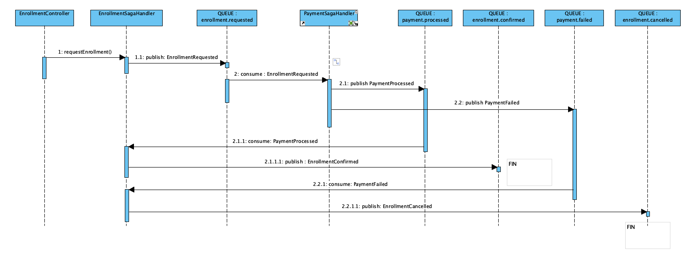
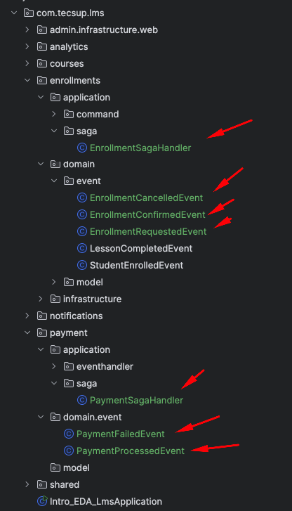

# IMPLEMENTACIÓN DEL PATRÓN SAGA 

Contexto :
Se desea realizar la matricula de un estudiante en un curso,a continuacion se describen los pasos a seguir para llevar a cabo este proceso utilizando el patrón Saga para manejar las transacciones distribuidas y asegurar la consistencia de los datos.
- 1.- EL estudiante solicita la matricula en un curso. (Enrollment)
- 2.- El sistema verifica si el estudiante realizo el pago de la matricula. (Payment)
- 3.- Si el pago es exitoso, se procede a registrar al estudiante en el curso. ( Enrollment)
- 4.- Si el pago no se realizo correctamente, se cancela la solicitud de matricula. ( Enrollment)





# I.- IMPLEMENTACIÓN de la publicación del Evento EnrollmentRequestedEvent

## 1.- Definir el evento EnrollmentRequestedEvent.java

```java

package com.tecsup.lms.enrollments.domain.event;

import com.tecsup.lms.shared.domain.event.DomainEvent;
import lombok.AllArgsConstructor;
import lombok.Data;
import lombok.NoArgsConstructor;

import java.math.BigDecimal;
import java.time.LocalDateTime;

@Data
@NoArgsConstructor
@AllArgsConstructor
public class EnrollmentRequestedEvent extends DomainEvent {

    private String enrollmentId;
    private String studentId;
    private String studentName;
    private String courseId;
    private BigDecimal amount;
    private LocalDateTime timestamp;

    @Override
    public String getKey() {
        return enrollmentId;
    }
}

```

## 2.- Definir EnrollmentSagaHandler.java

```java

package com.tecsup.lms.enrollments.application.saga;


import com.tecsup.lms.enrollments.domain.event.EnrollmentRequestedEvent;
import com.tecsup.lms.shared.infrastructure.event.KafkaEventPublisher;
import lombok.RequiredArgsConstructor;
import lombok.extern.slf4j.Slf4j;
import org.springframework.stereotype.Service;
import org.springframework.transaction.annotation.Transactional;

import java.math.BigDecimal;
import java.time.LocalDateTime;
import java.util.UUID;

@Slf4j
@Service
@RequiredArgsConstructor
public class EnrollmentSagaHandler {

    private final KafkaEventPublisher kafkaEventPublisher;

    @Transactional
    public String requestEnrollment(String studentId, String studentName, String courseId, BigDecimal amount) {

        log.info("🚀 [SAGA] Iniciando saga de matrícula");

        // 1. Generar ID
        String enrollmentId = "enrollment-" + UUID.randomUUID();

        // 2. Publicar evento para iniciar saga
        EnrollmentRequestedEvent requestEvent = new EnrollmentRequestedEvent(
                enrollmentId,
                studentId,
                studentName,
                courseId,
                amount,
                LocalDateTime.now()
        );
        // Publicar el comando de inscripción
        kafkaEventPublisher.publish(requestEvent);

        return enrollmentId;
    }
}

```

## 3.- Adaptar el controlador EnrollmentController.java , EnrollmentRequest y EnrollmentResponse

EnrollmentRequest.java
```java

package com.tecsup.lms.enrollments.infrastructure.dto;

import lombok.Data;

import java.math.BigDecimal;

@Data
public class EnrollmentRequest {
    private  String studentId;
    private  String studentName;
    private  String courseId;

    // Nuevo campo
    private BigDecimal amount;

}

```

EnrollmentResponse.java
```java

package com.tecsup.lms.enrollments.infrastructure.dto;

import lombok.AllArgsConstructor;
import lombok.Builder;
import lombok.Data;

@Builder
@Data
@AllArgsConstructor
public class EnrollmentResponse {
    private String enrollmentId;

    // nuevos campos
    private String status;
    private String message;
}

```
EnrollmentController.java

- Agregar el siguiente método al controlador:

```java

package com.tecsup.lms.enrollments.infrastructure.web;

    @PostMapping
    public ResponseEntity<EnrollmentResponse>
    enrollStudent(@RequestBody EnrollmentRequest request) {
    
        EnrollStudentCommand command = new EnrollStudentCommand(
                request.getStudentId(),
                request.getStudentName(),
                request.getCourseId()
        );
    
    
        String enrollmentId = enrollmentCommandHandler.enrollStudent(command);
    
        // ADAPTAR --------------------------------
        return ResponseEntity.ok(EnrollmentResponse
                .builder()
                .enrollmentId(enrollmentId)
                .build());
        // ADAPTAR --------------------------------
    }


    // ========================================
    // SAGA
    // ========================================

    private final EnrollmentSagaHandler sagaHandler;

    @PostMapping("/request")
    public ResponseEntity<EnrollmentResponse> requestEnrollment(
            @RequestBody EnrollmentRequest request) {

        // Iniciar saga
        String enrollmentId = this.sagaHandler.requestEnrollment(request.getStudentId(),
                request.getStudentName(),
                request.getCourseId(),
                request.getAmount());

        EnrollmentResponse response = EnrollmentResponse.builder()
                                    .enrollmentId(enrollmentId)
                                    .status("PENDING")
                                    .message("Enrollment request is being processed")
                                    .build();

        return ResponseEntity
                .status(HttpStatus.ACCEPTED)
                .body(response);
    }
```

## 4.- Adaptar el nuevo topic "enrollment-requests" en KafkaConfig.java

Hacer las siguientes modificaciones en KafkaConfig.java:
```java

package com.tecsup.lms.shared.infrastructure.config;


    // SAGA
    public static final String ENROLLMENT_REQUEST_TOPIC = "enrollment.requested";

    // SAGA
    @Bean
    public NewTopic enrollmentRequestedTopic() {
        return TopicBuilder
                .name(ENROLLMENT_REQUEST_TOPIC)
                .partitions(3)
                .replicas(1)
                .build();
    }

```
## 5.- Adaptar en KafkaEventPublisher.java para enviar el evento EnrollmentRequestedEvent


```java
package pe.edu.tecsup.lms.shared.infrastructure.event;

import lombok.RequiredArgsConstructor;
import lombok.extern.slf4j.Slf4j;
import org.springframework.kafka.core.KafkaTemplate;
import org.springframework.stereotype.Component;
import pe.edu.tecsup.lms.courses.domain.event.CourseCreatedEvent;
import pe.edu.tecsup.lms.courses.domain.event.CoursePublishedEvent;
import pe.edu.tecsup.lms.enrollments.domain.event.EnrollmentRequestedEvent;
import pe.edu.tecsup.lms.shared.domain.event.DomainEvent;
import pe.edu.tecsup.lms.shared.infrastructure.config.KafkaConfig;

@Slf4j
@Component
@RequiredArgsConstructor
public class KafkaEventPublisher {

    private final KafkaTemplate<String, DomainEvent> kafkaTemplate;

    public void publish(DomainEvent event) {

        log.info("Publishing {}", event);

        String topic = getTopicFromEvent(event); // Nuevo cambio

        String key = event.getKey();

        //

        this.kafkaTemplate.send(
                topic,          // Nuevo cambio
                key,
                event);

    }

    //Nuevo método
    
    private String getTopicFromEvent(DomainEvent event) {

        if ( event instanceof CourseCreatedEvent ||
                event instanceof CoursePublishedEvent) {
            return KafkaConfig.COURSE_EVENTS_TOPIC;
        } else if (event instanceof EnrollmentRequestedEvent) {  // AGREGAR
            return KafkaConfig.ENROLLMENT_REQUEST_TOPIC;         // AGREGAR
        } else {
            throw new IllegalArgumentException("Unknown event type: " + event.getEventType());
        }
    }
    
}
```
## 6.- Pruebas

```json
POST http://localhost:8080/api/enrollments/request
{
"studentId": "student-21",
"studentName": "Jose Leon",
"courseId": "course-100",
"amount": 99.99
} 
```

- Usando Postman, el enlace del <a href="postman/EDA_SAGA.postman_collection.json">Json</a> para Postman 

- Usando curl

```bash
curl -s -X POST http://localhost:9099/api/es/enrollments/request \
-H "Content-Type: application/json" \
-d '{
"studentId": "student-21",
"studentName": "Jose Leon",
"courseId": "course-100",
"amount": 99.99
}'
```

# II.- IMPLEMENTACIÓN del consumidor del Evento EnrollmentRequestedEvent

## 1.- Definir el evento PaymentProcessedEvent.java

```java

package com.tecsup.lms.payment.domain.event;

import com.tecsup.lms.shared.domain.event.DomainEvent;
import lombok.AllArgsConstructor;
import lombok.Getter;
import lombok.NoArgsConstructor;

import java.math.BigDecimal;
import java.time.LocalDateTime;

@Getter
@NoArgsConstructor
@AllArgsConstructor
public class PaymentProcessedEvent extends DomainEvent {

    private String enrollmentId;
    private String transactionId;
    private BigDecimal amount;
    private LocalDateTime timestamp;

    @Override
    public String getKey() {
        return enrollmentId;
    }

}

```

## 2.- Definir  PaymentSagaHandler.java

```java


import com.tecsup.lms.enrollments.domain.event.EnrollmentRequestedEvent;
import com.tecsup.lms.payment.domain.event.PaymentProcessedEvent;
import com.tecsup.lms.shared.infrastructure.config.KafkaConfig;
import com.tecsup.lms.shared.infrastructure.event.KafkaEventPublisher;
import lombok.RequiredArgsConstructor;
import lombok.extern.slf4j.Slf4j;
import org.springframework.kafka.annotation.KafkaListener;
import org.springframework.stereotype.Service;
import org.springframework.transaction.annotation.Transactional;

import java.time.LocalDateTime;
import java.util.Random;
import java.util.UUID;

@Slf4j
@Service
@RequiredArgsConstructor
public class PaymentSagaHandler {

    private final KafkaEventPublisher kafkaEventPublisher;
    private final Random random = new Random();

    @KafkaListener(
            topics = KafkaConfig.ENROLLMENT_REQUESTED_TOPIC,  //"enrollment.requested",
            groupId = "payment-service-group"
    )
    @Transactional
    public void handleEnrollmentRequested(EnrollmentRequestedEvent event) {

        log.info("💳 [PAYMENT] Procesando pago para enrollment");
        log.info("   Enrollment ID: {}", event.getEnrollmentId());
        log.info("   Student: {}", event.getStudentName());
        log.info("   Amount: ${}", event.getAmount());

        try {
            // Simular tiempo de procesamiento
            Thread.sleep(1000 + random.nextInt(2000)); // 1-3 segundos

            // Simular resultado: 60% éxito, 40% fallo
            boolean paymentSuccess = random.nextInt(100) < 60;

            if(paymentSuccess) {

                // PAGO EXITOSO

                log.info("✅ [PAYMENT] Pago procesado exitosamente para enrollment ID: {}", event.getEnrollmentId());
                // Aquí se podría publicar un evento de pago exitoso si fuera necesario

                // PaymentProcessedEvent

                String transactionId = "tx-" + UUID.randomUUID();

                PaymentProcessedEvent processedEvent = new PaymentProcessedEvent(
                        event.getEnrollmentId(),
                        transactionId,
                        event.getAmount(),
                        LocalDateTime.now());

                kafkaEventPublisher.publish(processedEvent);

                log.info("✅ [PAYMENT] Pago procesado exitosamente");
                log.info("   Transaction ID: {}", transactionId);

            } else {
                log.warn("❌ [PAYMENT] El pago falló para enrollment ID: {}", event.getEnrollmentId());
                // Aquí se podría publicar un evento de pago fallido si fuera necesario
                // PaymentFailedEvent

            }


        } catch (Exception e) {
            log.error("💥 [PAYMENT] Error procesando pago", e);
        }

    }

}

```


## 3.- Modificar   KafkaConfig.java

```java

package com.tecsup.lms.shared.infrastructure.config;

import org.apache.kafka.clients.admin.NewTopic;
import org.springframework.context.annotation.Bean;
import org.springframework.context.annotation.Configuration;
import org.springframework.kafka.annotation.EnableKafka;
import org.springframework.kafka.config.TopicBuilder;

/**
 * KafkaConfig
 *
 *             Topic       -->     Particiones
 *       Eventos del curso             3
 *          course.events
 */
@EnableKafka
@Configuration
public class KafkaConfig {

    // Setting topics
    public static final String COURSE_EVENTS_TOPIC = "course.events";

    // DLQ
    public static final String DLQ_COURSE_EVENTS_TOPIC = "dlq.course.events";  // ✅ DLQ Topic

    // SAGA
    public static final String ENROLLMENT_REQUESTED_TOPIC = "enrollment.requested";
    public static final String PAYMENT_PROCESSED_TOPIC = "payment.processed";   // AGREGAR


    // Setting Queues/Partitions

    /**
     *  Topic de eventos de cursos
     * @return
     */
    @Bean
    public NewTopic courseEventsTopic() {
        return new NewTopic(COURSE_EVENTS_TOPIC, // topic
                3,  // Nro particiones
                (short) 1  // Nro de replicas
        );
    }

    // DLQ
    @Bean
    public NewTopic dlqCourseEventsTopic() {
        return TopicBuilder.name(DLQ_COURSE_EVENTS_TOPIC)
                .partitions(1)
                .replicas(1)
                .build();
    }

    // SAGA
    @Bean
    public NewTopic enrollmentRequestedTopic() {
        return TopicBuilder
                .name(ENROLLMENT_REQUESTED_TOPIC)
                .partitions(3)
                .replicas(1)
                .build();
    }

    // NUEVO BEAN
    @Bean
    public NewTopic paymentProcessedTopic() {
        return TopicBuilder
                .name(PAYMENT_PROCESSED_TOPIC)
                .partitions(3)
                .replicas(1)
                .build();
    }

}


```

## 4.- Modificar   KafkaEventPublisher.java

```java


import com.tecsup.lms.courses.domain.event.CourseCreatedEvent;
import com.tecsup.lms.courses.domain.event.CoursePublishedEvent;
import com.tecsup.lms.enrollments.domain.event.EnrollmentRequestedEvent;
import com.tecsup.lms.payment.domain.event.PaymentProcessedEvent;
import com.tecsup.lms.shared.domain.event.DomainEvent;
import com.tecsup.lms.shared.infrastructure.config.KafkaConfig;
import lombok.RequiredArgsConstructor;
import lombok.extern.slf4j.Slf4j;
import org.springframework.kafka.core.KafkaTemplate;
import org.springframework.stereotype.Component;

@Slf4j
@Component
@RequiredArgsConstructor
public class KafkaEventPublisher {

    //private final ApplicationEventPublisher publisher;
    private final KafkaTemplate<String, DomainEvent> kafkaTemplate;

    public void publish(DomainEvent event) {
        log.info("Publicando: {} [{}]", event.getEventType(), event.getEventId());

        //publisher.publishEvent(event);

        String topic = getTopicFromEvent(event);

        String key = event.getKey(); // devuelva el course Id


        kafkaTemplate.send(
                topic,  // KafkaConfig.COURSE_EVENTS_TOPIC,
                key,
                event
        );

        // La key sirve para identificar a que particion va el mensaje
        // HASH(key) % N_PARTICIONES = particion


    }

    private String getTopicFromEvent(DomainEvent event) {

        if ( event instanceof CourseCreatedEvent ||
                event instanceof CoursePublishedEvent) {
            return KafkaConfig.COURSE_EVENTS_TOPIC;
        } else if (event instanceof EnrollmentRequestedEvent) {
            return KafkaConfig.ENROLLMENT_REQUESTED_TOPIC;
        } else if (event instanceof PaymentProcessedEvent) {  // AGREGAR
            return KafkaConfig.PAYMENT_PROCESSED_TOPIC;       // AGREGAR
        } else {
            throw new IllegalArgumentException("Unknown event type: " + event.getEventType());
        }

    }
}

```


## 5.- Pruebas

```json
POST http://localhost:8080/api/enrollments/request
{
"studentId": "student-21",
"studentName": "Jose Leon",
"courseId": "course-100",
"amount": 99.99
} 
```

# III.- IMPLEMENTACIÓN del consumidor del Evento PaymentProcessedEvent

## 1.- Modificar EnrollmentSagaHandler.java

```java
package com.tecsup.lms.enrollments.application.saga;

import com.tecsup.lms.enrollments.domain.event.EnrollmentRequestedEvent;
import com.tecsup.lms.payment.domain.event.PaymentProcessedEvent;
import com.tecsup.lms.shared.infrastructure.config.KafkaConfig;
import com.tecsup.lms.shared.infrastructure.event.KafkaEventPublisher;
import lombok.RequiredArgsConstructor;
import lombok.extern.slf4j.Slf4j;
import org.springframework.kafka.annotation.KafkaListener;
import org.springframework.stereotype.Service;
import org.springframework.transaction.annotation.Transactional;

import java.math.BigDecimal;
import java.time.LocalDateTime;
import java.util.UUID;

@Slf4j
@Service
@RequiredArgsConstructor
public class EnrollmentSagaHandler {

    private final KafkaEventPublisher kafkaEventPublisher;

    @Transactional
    public String requestEnrollment(String studentId, String studentName, String courseId, BigDecimal amount) {

        log.info("🚀 [SAGA] Iniciando saga de matrícula");

        // 1. Generar ID
        String enrollmentId = "enrollment-" + UUID.randomUUID();

        // 2. Publicar evento para iniciar saga
        EnrollmentRequestedEvent requestEvent = new EnrollmentRequestedEvent(
                enrollmentId,
                studentId,
                studentName,
                courseId,
                amount,
                LocalDateTime.now()
        );
        // Publicar el comando de inscripción
        kafkaEventPublisher.publish(requestEvent);

        return enrollmentId;
    }

   // NUEVO METODO
    /**
     * PASO 2: Reaccionar a pago exitoso
     */
    @KafkaListener(
            topics = KafkaConfig.PAYMENT_PROCESSED_TOPIC,
            groupId = "enrollment-saga-group"
    )
    @Transactional
    public void handlePaymentProcessed(PaymentProcessedEvent event) {

        log.info("💳 [SAGA] Pago procesado exitosamente");
        log.info("   Enrollment ID: {}", event.getEnrollmentId());
        log.info("   Transaction ID: {}", event.getTransactionId());

        // TODO --> DEBE CONTINUAR EL PROCESO DE MATRICULA

        log.info("✅ [SAGA] Enrollment confirmada");
        log.info("📨 [SAGA] Evento EnrollmentConfirmed publicado");
    }


}

```


## 2.- Pruebas
 
```json
POST http://localhost:8080/api/enrollments/request
{
"studentId": "student-21",
"studentName": "Jose Leon",
"courseId": "course-100",
"amount": 99.99
} 
```

# IV.- IMPLEMENTACIÓN del publicador del Evento PaymentFailedEvent

## 1.- Crear PaymentFailedEvent.java 

```java

package com.tecsup.lms.payment.domain.event;

import com.tecsup.lms.shared.domain.event.DomainEvent;
import lombok.AllArgsConstructor;
import lombok.Getter;
import lombok.NoArgsConstructor;

import java.time.LocalDateTime;

@Getter
@NoArgsConstructor
@AllArgsConstructor
public class PaymentFailedEvent extends DomainEvent {

    private String enrollmentId;
    private String reason;
    private String errorCode;
    private LocalDateTime timestamp;

    @Override
    public String getKey() {
        return enrollmentId;
    }
}

```

## 2.- Modificar PaymentSagaHandler.java ( Cuando el pago falla)

```java
package com.tecsup.lms.payment.application.saga;

import com.tecsup.lms.enrollments.domain.event.EnrollmentRequestedEvent;
import com.tecsup.lms.payment.domain.event.PaymentFailedEvent;
import com.tecsup.lms.payment.domain.event.PaymentProcessedEvent;
import com.tecsup.lms.shared.infrastructure.config.KafkaConfig;
import com.tecsup.lms.shared.infrastructure.event.KafkaEventPublisher;
import lombok.RequiredArgsConstructor;
import lombok.extern.slf4j.Slf4j;
import org.springframework.kafka.annotation.KafkaListener;
import org.springframework.stereotype.Service;
import org.springframework.transaction.annotation.Transactional;

import java.time.LocalDateTime;
import java.util.Random;
import java.util.UUID;

@Slf4j
@Service
@RequiredArgsConstructor
public class PaymentSagaHandler {

    private final KafkaEventPublisher kafkaEventPublisher;
    private final Random random = new Random();

    @KafkaListener(
            topics = KafkaConfig.ENROLLMENT_REQUESTED_TOPIC,  //"enrollment.requested",
            groupId = "payment-service-group"
    )
    @Transactional
    public void handleEnrollmentRequested(EnrollmentRequestedEvent event) {

        log.info("💳 [PAYMENT] Procesando pago para enrollment");
        log.info("   Enrollment ID: {}", event.getEnrollmentId());
        log.info("   Student: {}", event.getStudentName());
        log.info("   Amount: ${}", event.getAmount());

        try {
            // Simular tiempo de procesamiento
            Thread.sleep(1000 + random.nextInt(2000)); // 1-3 segundos

            // Simular resultado: 60% éxito, 40% fallo
            boolean paymentSuccess = random.nextInt(100) < 60;

            if(paymentSuccess) {

                // PAGO EXITOSO

                log.info("✅ [PAYMENT] Pago procesado exitosamente para enrollment ID: {}", event.getEnrollmentId());
                // Aquí se podría publicar un evento de pago exitoso si fuera necesario

                // PaymentProcessedEvent

                String transactionId = "tx-" + UUID.randomUUID();

                PaymentProcessedEvent processedEvent = new PaymentProcessedEvent(
                        event.getEnrollmentId(),
                        transactionId,
                        event.getAmount(),
                        LocalDateTime.now());

                kafkaEventPublisher.publish(processedEvent);

                log.info("✅ [PAYMENT] Pago procesado exitosamente");
                log.info("   Transaction ID: {}", transactionId);

            } else {
                // ---------------------- NUEVO -------------------
                // PAGO FALLIDO 

                log.warn("❌ [PAYMENT] El pago falló para enrollment ID: {}", event.getEnrollmentId());
                // Aquí se podría publicar un evento de pago fallido si fuera necesario
                // PaymentFailedEvent

                PaymentFailedEvent failedEvent = new PaymentFailedEvent(
                        event.getEnrollmentId(),
                        "PAYMENT_DECLINED",
                        "El pago fue rechazado por el proveedor, saldo insuficiente.",
                        LocalDateTime.now()
                );

                this.kafkaEventPublisher.publish(failedEvent);

                log.warn("📨 [PAYMENT] Evento PaymentFailed publicado");
                
                // ---------------------- NUEVO -------------------

            }


        } catch (Exception e) {
            log.error("💥 [PAYMENT] Error procesando pago", e);
        }

    }

}

```
## 3.- Modificar KafkaConfig.java

```java

package com.tecsup.lms.shared.infrastructure.config;

import org.apache.kafka.clients.admin.NewTopic;
import org.springframework.context.annotation.Bean;
import org.springframework.context.annotation.Configuration;
import org.springframework.kafka.annotation.EnableKafka;
import org.springframework.kafka.config.TopicBuilder;

/**
 * KafkaConfig
 *
 *             Topic       -->     Particiones
 *       Eventos del curso             3
 *          course.events
 */
@EnableKafka
@Configuration
public class KafkaConfig {

    // Setting topics
    public static final String COURSE_EVENTS_TOPIC = "course.events";

    // DLQ
    public static final String DLQ_COURSE_EVENTS_TOPIC = "dlq.course.events";  // ✅ DLQ Topic

    // SAGA
    public static final String ENROLLMENT_REQUESTED_TOPIC = "enrollment.requested";
    public static final String PAYMENT_PROCESSED_TOPIC = "payment.processed";
    public static final String PAYMENT_FAILED_TOPIC = "payment.failed";  // AGREGAR


    // Setting Queues/Partitions

    /**
     *  Topic de eventos de cursos
     * @return
     */
    @Bean
    public NewTopic courseEventsTopic() {
        return new NewTopic(COURSE_EVENTS_TOPIC, // topic
                3,  // Nro particiones
                (short) 1  // Nro de replicas
        );
    }

    // DLQ
    @Bean
    public NewTopic dlqCourseEventsTopic() {
        return TopicBuilder.name(DLQ_COURSE_EVENTS_TOPIC)
                .partitions(1)
                .replicas(1)
                .build();
    }

    // SAGA
    @Bean
    public NewTopic enrollmentRequestedTopic() {
        return TopicBuilder
                .name(ENROLLMENT_REQUESTED_TOPIC)
                .partitions(3)
                .replicas(1)
                .build();
    }

    @Bean
    public NewTopic paymentProcessedTopic() {
        return TopicBuilder
                .name(PAYMENT_PROCESSED_TOPIC)
                .partitions(3)
                .replicas(1)
                .build();
    }


    // NUEVO BEAN
    @Bean
    public NewTopic paymentFailedTopic() {
        return TopicBuilder
                .name(PAYMENT_FAILED_TOPIC)
                .partitions(3)
                .replicas(1)
                .build();
    }

}


``` 

## 4.- Modificar KafkaEventPublisher.java

```java

package com.tecsup.lms.shared.infrastructure.event;

import com.tecsup.lms.courses.domain.event.CourseCreatedEvent;
import com.tecsup.lms.courses.domain.event.CoursePublishedEvent;
import com.tecsup.lms.enrollments.domain.event.EnrollmentRequestedEvent;
import com.tecsup.lms.payment.domain.event.PaymentFailedEvent;
import com.tecsup.lms.payment.domain.event.PaymentProcessedEvent;
import com.tecsup.lms.shared.domain.event.DomainEvent;
import com.tecsup.lms.shared.infrastructure.config.KafkaConfig;
import lombok.RequiredArgsConstructor;
import lombok.extern.slf4j.Slf4j;
import org.springframework.kafka.core.KafkaTemplate;
import org.springframework.stereotype.Component;

@Slf4j
@Component
@RequiredArgsConstructor
public class KafkaEventPublisher {

    //private final ApplicationEventPublisher publisher;
    private final KafkaTemplate<String, DomainEvent> kafkaTemplate;

    public void publish(DomainEvent event) {
        log.info("Publicando: {} [{}]", event.getEventType(), event.getEventId());

        //publisher.publishEvent(event);

        String topic = getTopicFromEvent(event);

        String key = event.getKey(); // devuelva el course Id


        kafkaTemplate.send(
                topic,  // KafkaConfig.COURSE_EVENTS_TOPIC,
                key,
                event
        );

        // La key sirve para identificar a que particion va el mensaje
        // HASH(key) % N_PARTICIONES = particion


    }

    private String getTopicFromEvent(DomainEvent event) {

        if ( event instanceof CourseCreatedEvent ||
                event instanceof CoursePublishedEvent) {
            return KafkaConfig.COURSE_EVENTS_TOPIC;
        } else if (event instanceof EnrollmentRequestedEvent) {
            return KafkaConfig.ENROLLMENT_REQUESTED_TOPIC;
        } else if (event instanceof PaymentProcessedEvent) {
            return KafkaConfig.PAYMENT_PROCESSED_TOPIC;
        } else if (event instanceof PaymentFailedEvent) {   // AGREGAR
            return KafkaConfig.PAYMENT_FAILED_TOPIC;        // AGREGAR
        } else {
            throw new IllegalArgumentException("Unknown event type: " + event.getEventType());
        }

    }
}
 
```


## 5.- Pruebas

```json
GET http://localhost:8080/api/enrollments/request
{
"studentId": "student-21",
"studentName": "Jose Leon",
"courseId": "course-100",
"amount": 99.99
} 
```